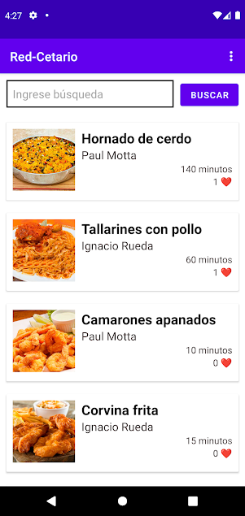
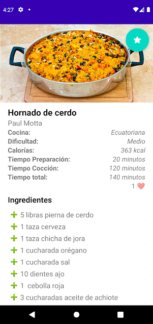
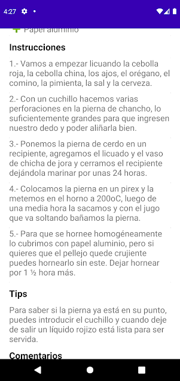
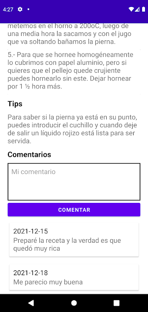
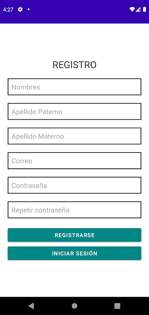

# RED-CETARIO

Proyecto final de DAM

## Descripción

- La aplicación permite ver un listado de recetas proveniente de un servicio web
- La aplicación permite autenticarse
- La aplicación permite seleccionar una receta y ver los detalles de esta
- La aplicación permite comentar una receta si el usuario está autenticado
- La aplicación permite obtener notificaciones del servicio web
- La aplicación permite actualizar el perfil del usuario

## Descargar

Puedes descargar la aplicación directamente desde la playstore en este enlace: 
[Redcetario](https://play.google.com/store/apps/details?id=com.untels.redcetario&hl=es_PE&gl=US)

## Capturas

